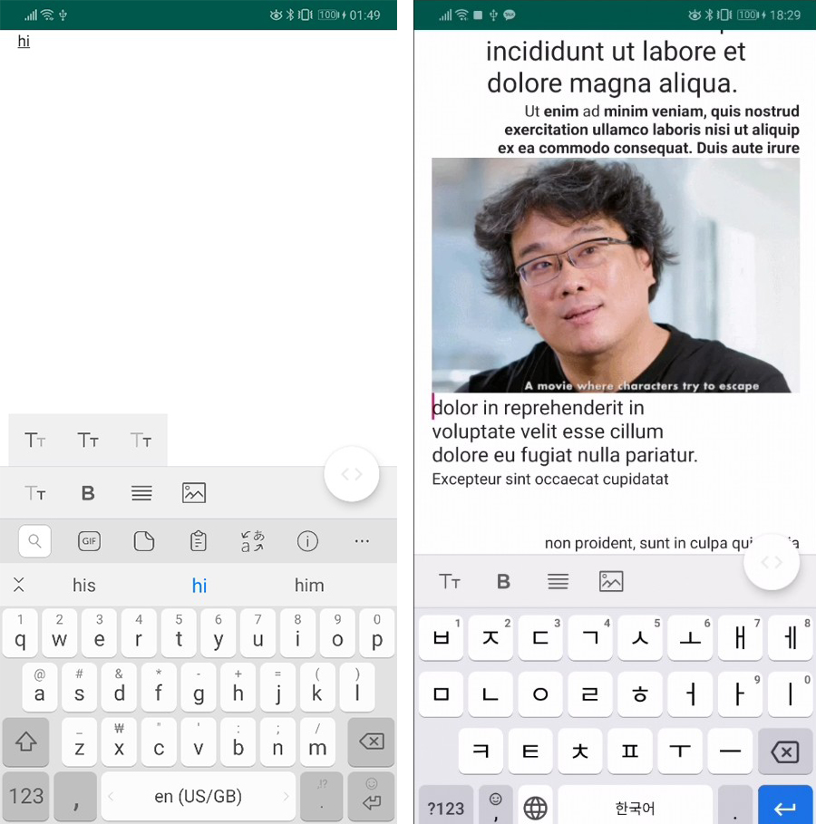

# IhtmlEditor

RecyclerView based Wysiwyg RichTextEditor
개발중인 개인프로젝트


## Feature
* FontSize (Heading 1-3)
* Bold
* Align (Left, Center, Right)
* Insert Image

## Skills
- Kotlin, Koin, Glide, DataBinding

## Getting Started

### 1. ieditor모듈 추가

### 2. 뷰모델 설정
```xml
<data>  
 <variable name="vm" type="kr.twothumb.ieditor.ui.HtmlEditorViewModel"/>  
 <variable name="imageVm" type="kr.twothumb.ieditor.ui.imagepicker.ImagePickerViewModel"/>  
</data>
```

### 3. 뷰레이아웃 추가
```xml
<kr.twothumb.ieditor.IEditorView  
  android:layout_width="0dp"  
  android:layout_height="0dp"   
  app:editor_vm="@{vm}"  
  app:editor_imgVm="@{imageVm}"/>
```

### 4. 이미지 추가 권한관련
```kotlin
override fun onRequestPermissionsResult(requestCode: Int, @NonNull permissions: Array<String>, @NonNull grantResults: IntArray) {  
    super.onRequestPermissionsResult(requestCode, permissions, grantResults)  
    if (requestCode == bind.vm?.readExternalStorage) {  
        if (grantResults.isNotEmpty() && grantResults[0] == PackageManager.PERMISSION_GRANTED) {  
            bind.vm?.callImagePicker(this)  
        }  
        else{  
            Toast.makeText(this, "권한에 동의하셔야 이미지 파일을 업로드 할수있습니다.", Toast.LENGTH_SHORT).show()  
        }  
    }  
}  
  
override fun onActivityResult(requestCode: Int, resultCode: Int, data: Intent?) {  
    super.onActivityResult(requestCode, resultCode, data)  
    if(requestCode == bind.vm?.selectImage){  
        if(resultCode == Activity.RESULT_OK)  
            bind.vm?.addImage(Uri.parse(data?.getStringExtra("selectedImage")))  
    }  
}
```


## TODO
* 기존구조 리팩토링
* Html 변환 알고리즘 재정의
* html parsing -> Html.TagHandler 써서 해결할수 있을거같다. md포맷 / JSON도 추가
* 두개 이상의 스타일이 들어갈때 태그 위치 정의


## Authors

* **Twothumb** (http://twothumb.kr/)
